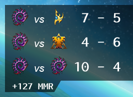

I wrote a web [scraper](https://gitlab.com/Rairden/SC2-StatsScraper/-/tree/release-win10) for Starcraft 2.

Unlike the web scraper, this program doesn't require using [sc2replaystats.com](https://sc2replaystats.com/). It simply uses a python module [sc2reader](https://pypi.org/project/sc2reader/) to parse your local replay files. Since I don't know python, I used Java to parse the python stdout and keep track of your win/loss stats. Java checks if your replay folder has a new file (every 5 seconds), and if so, writes your stats to three text files.



## How to install

1. Install Java 14 - Java(TM) SE Runtime Environment (build 14.0.1+7)
2. Build and create a jar from source code.
3. Place the application (SC2-replay.jar) anywhere on your system.
4. Install python and add it to your PATH environment variable.
5. Install the python `sc2reader` module.

```sh
pip install sc2reader
```

And finally run the program:

```sh
java -jar SC2-replay.jar
```

When you first run it, the jar will create two new files:

* settings.cfg
* printReplayShort.py

In order for the program to run, you must modify two lines in `settings.cfg`.

```sh
replays=E:\SC2\replayBackup
player=Gixxasaurus|Rairden
```

Change this line to wherever SC2 saves replays, or scelight is configured to backup replays. And change the player line to your SC2 account name.

I really like this program compared to my web scraper. The scraper would take 70 seconds (waiting on sc2replaystats.com to process the replay). This updated version there is no delay (it takes 150 ms on 8 replays).

Web scraper: 551 lines of code  
This app: 251 lines of code

